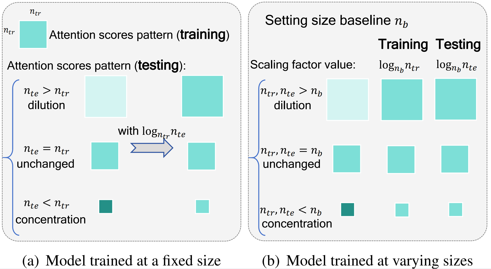
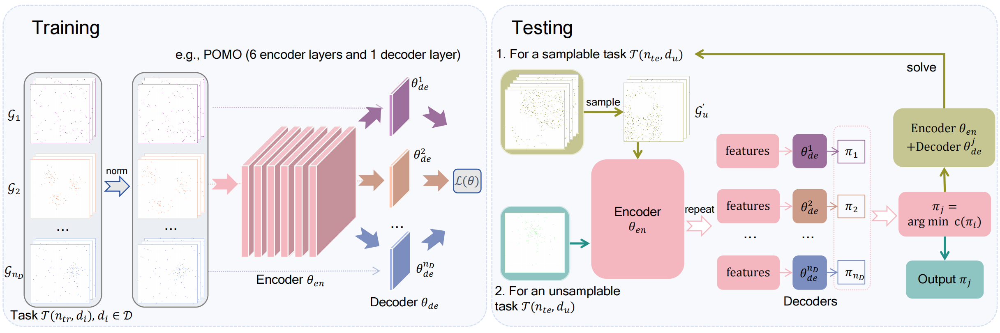

<h1 align="center"> Improving Generalization of Neural Vehicle Routing Problem Solvers Through the Lens of Model Architecture </h1>

* This work has been accepted by Neural Networks in Mar 2025. see [pdf](https://www.sciencedirect.com/science/article/pii/S089360802500259X) or [arxiv version](https://arxiv.org/abs/2406.06652)

This paper take a novel perspective on model architecture to enhance the generalization of neural VRP solvers, specifically propose an Entropy-based Scaling Factor (ESF) and a Distribution-Specific (DS) decoder to enhance the size and distribution generalization, respectively.
<p align="center"></p>
1. Implementation of Entropy-based Scaling Factor：

   1) Given a fix size-trained ($n_{tr}$) model (e.g., POMO), just need apply $\log_{n_{tr}}n_{te}$ within each attention module when solving VRPs of size $n_{te}$;
   2) Given an unfixed size-trained model (e.g., OMNI-VRP), just set a baseline $n_{b}$ (e.g., 50), and then apply $\log_{n_{b}}n_{tr}$ and $\log_{n_{b}}n_{te}$ during training and testing, respectively.

   We present the results of 2) on OMNI-VRP of solving CVRP (Just apply the ESF within each attention module).
   For 1), you can verify it by yourself.
   
<p align="center"></p>
2. Implementation of DS decoder：

   The DS decoder explicitly models VRPs of multiple training distribution patterns through multiple auxiliary light decoders.


### Acknowledgments

* We also would like to thank the following open-source repositories, which are baselines of our code:

  * https://github.com/jieyibi/AMDKD

  * https://github.com/yd-kwon/POMO

  * https://github.com/RoyalSkye/Omni-VRP


### Citation

If you find our paper and code useful, please cite our paper:

```tex
@article{XIAO2025107380,
title = {Improving generalization of neural Vehicle Routing Problem solvers through the lens of model architecture},
journal = {Neural Networks},
volume = {187},
pages = {107380},
year = {2025},
author = {Yubin Xiao and Di Wang and Xuan Wu and Yuesong Wu and Boyang Li and Wei Du and Liupu Wang and You Zhou},
}
```
